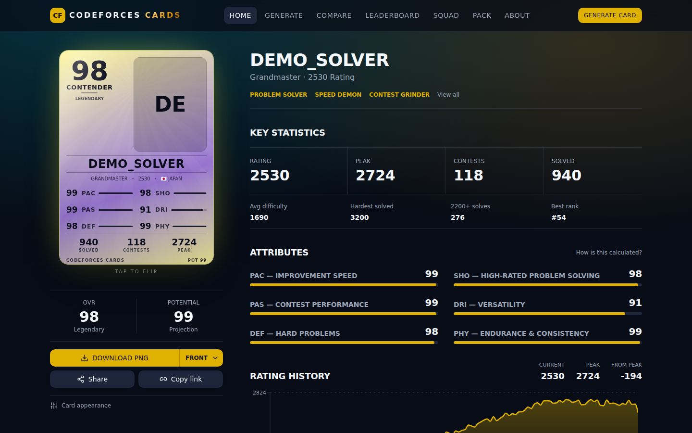
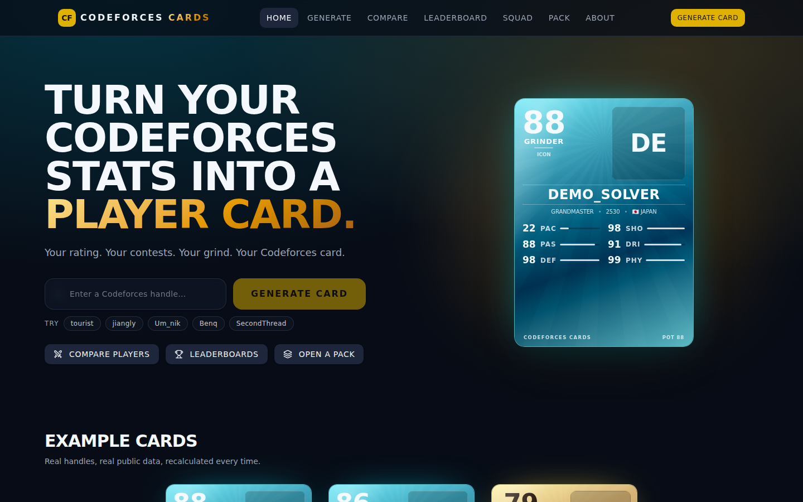
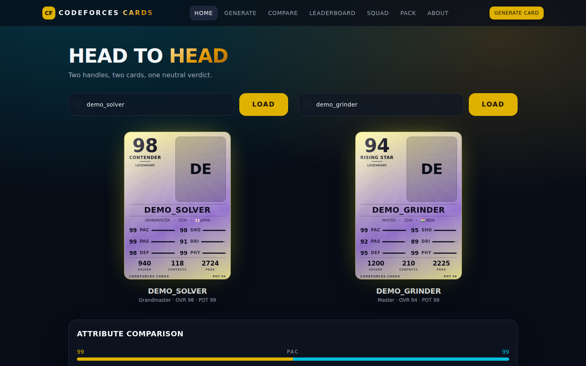
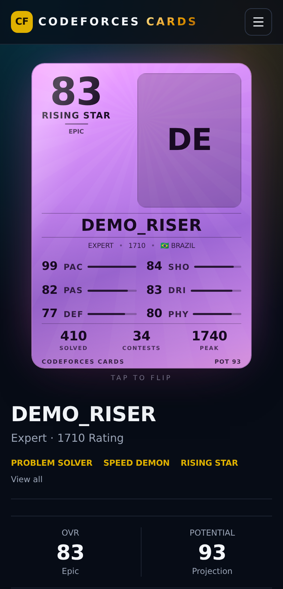

# Codeforces Cards

[](https://github.com/Nandansai08/cf-cards/actions/workflows/ci.yml)
[](LICENSE)
[](CONTRIBUTING.md)

**Live: <https://nandansai08.github.io/cf-cards/>**

Turn any Codeforces handle into a collectible, Ultimate-Team-style player card:
an overall rating (OVR), six attributes, a rarity tier, playstyle badges,
achievements and full rating history — all computed from public Codeforces data.

**Nothing is random.** Every number on a card is a deterministic function of the
handle's public Codeforces history, so the same handle always produces the same
card. The full methodology is documented in-app on `/about`.

## Screenshots



_The player profile — the card, key statistics, the six attributes and the full
rating history._



_Landing page._



_Head to head: two cards, compared attribute by attribute._

<p align="center">
  
</p>

<p align="center"><em>The card is the centrepiece on a phone too.</em></p>

> These screenshots are rendered from generated demo players, not real handles,
> so they stay reproducible and don't attach invented statistics to a real
> person. The app itself is unmodified — the actual rating engine produced every
> number you see. Regenerate them with `npm run screenshots` (see
> [CONTRIBUTING.md](CONTRIBUTING.md)).

## Features

| Route             | What it does                                                                                                      |
| ----------------- | ----------------------------------------------------------------------------------------------------------------- |
| `/`               | Landing page — handle search, example cards, rating methodology, rarity tiers                                     |
| `/generate`       | Enter a handle and generate a card                                                                                |
| `/player/$handle` | Full public profile: card, key stats, attributes, rating chart, form, analysis, achievements, evolution           |
| `/compare`        | Two handles side by side, attribute-by-attribute, with a neutral summary                                          |
| `/leaderboard`    | Ranks the cards you have generated — OVR, potential, solved, rating gained, contests — plus a live featured table |
| `/squad`          | Build a five-player lineup with a squad OVR and synergy score                                                     |
| `/pack`           | Pack-opening reveal: rarity to OVR to card                                                                        |

Cards can be flipped, restyled (frame, background, tier theme — visuals only,
never the stats) and exported as PNG in front / back / both / story formats.

## The rating model

Six attributes, each scaled 1-99 and derived from public data:

| Attribute | Meaning                                | Weight in OVR |
| --------- | -------------------------------------- | ------------- |
| `PAS`     | Contest performance and consistency    | 30%           |
| `SHO`     | High-rated problem solving             | 22%           |
| `DEF`     | Difficult-problem performance          | 15%           |
| `DRI`     | Versatility across tags and difficulty | 13%           |
| `PHY`     | Endurance and consistency over time    | 12%           |
| `PAC`     | Improvement speed / rating growth      | 8%            |

Volume-based inputs (problems solved, contests played, tags, active months) are
log-scaled so that huge problem counts add diminishing value instead of
dominating the card — difficulty and contest results carry the most weight.
Potential adds a bounded bonus (max +12) from recent trajectory; it is an
estimate for fun, not a prediction.

OVR is a Codeforces Cards metric. It is **not** an official Codeforces rating.

## Data

All data comes from the public Codeforces API — `user.info`, `user.rating` and
`user.status`. No login, no private data, no API keys. Requests are serialized
with a small gap to respect Codeforces rate limits and cached in the browser for
30 minutes. Country and organization are shown only when Codeforces publishes
them; nothing is fabricated.

A Codeforces account can have two separate pictures — `titlePhoto` and
`avatar` — and the API fills the missing one with a `no-title.jpg` stand-in
rather than leaving it blank, so a card tries both and ignores the stand-ins.
Each URL is checked against the known Codeforces hosts before it is used.

Pictures load straight from Codeforces first. That often fails on any other
origin: Codeforces refuses its userpic images to a foreign referer, which is
why the same URL opens fine in a tab from Codeforces itself and nowhere else.
The card then retries once through a proxy, and falls back to the handle's
initials if that fails too.

Which proxy depends on `VITE_AVATAR_PROXY`. Set it to a deployed
[`workers/avatar-proxy`](workers/avatar-proxy) — a small Cloudflare Worker that
asks Codeforces with the referer it expects and re-serves the bytes with
permissive CORS headers — and pictures work. Leave it unset and the fallback is
[wsrv.nl](https://wsrv.nl), a public image cache, which fetches server-side and
so is often refused for the same reason. To drop both, make `avatarChain` in
`src/lib/codeforces.ts` return only the direct URL.

Being cross-origin, the pictures would taint the canvas that PNG export draws
into, so exported cards always show initials rather than the photo.

### Where your cards live

Generated cards are written to `localStorage` and never leave the browser: the
site is static and has no backend. That is why the leaderboard ranks the cards
generated on _your_ device rather than everyone's — a shared board would need a
server to collect them.

The deployed site does load Google Analytics, configured by `VITE_GA_ID` in the
deploy workflow. Development builds, the test suite and any fork load no
analytics at all, because the variable is unset there — set your own ID if you
want measurement.

## Tech stack

- [TanStack Start](https://tanstack.com/start) (file-based routing) + TanStack Router / Query
- React 19 + TypeScript
- Tailwind CSS v4 with an oklch semantic token system
- shadcn/ui (new-york) + Radix primitives
- Recharts for the rating history chart, `html-to-image` for PNG export

No backend, no database, no environment variables — the browser talks to the
Codeforces API directly.

## Development

Requires Node.js 22+ (some TanStack packages declare `node >=22.12`).

```sh
npm install
npm run dev        # dev server
npm run build      # production build
npm run build:pages # static build, as published
npm run preview    # serve the static build the way GitHub Pages does
npm test           # end-to-end tests (Playwright)
npm run lint       # eslint
```

Routes live in `src/routes/` (file-based — `routeTree.gen.ts` is generated, do
not edit it by hand). The rating engine is `src/lib/fut.ts`, the Codeforces
client is `src/lib/codeforces.ts`, and the card components are in
`src/components/fut/`.

Before pushing, run the same checks CI runs:

```sh
npm run lint
npx tsc --noEmit
npm run build
npm run build:pages
npm test
```

Tests run against the production build with the Codeforces API stubbed, so they
never touch the real API. See [CONTRIBUTING.md](CONTRIBUTING.md#tests).

## Deployment

The site is a fully static single-page app, published to GitHub Pages by
`.github/workflows/deploy-pages.yml` on every push to the default branch.

Pages has to be turned on once by hand before the first deploy — a workflow
token is not allowed to do it. In **Settings → Pages**, set **Source** to
**GitHub Actions**, then re-run the workflow.

```sh
BASE_PATH=/cf-cards/ npm run build:pages   # -> dist/pages, ready to upload
```

`npm run build:pages` differs from `npm run build` in three ways, because Pages
is a file host with no server:

- nitro is skipped, so there is no server bundle
- TanStack Start renders a single shell, which the post-build step copies to
  both `index.html` and `404.html` so deep links like `/player/tourist` reach
  the client router instead of GitHub's 404 page
- `BASE_PATH` prefixes every asset and route, since the site is served from a
  subpath rather than a domain root

`.nojekyll` is written into the output as well — without it GitHub would strip
the `assets/` directory, because Jekyll ignores paths starting with `_`.

There is no server-side code and no build secret, so the app can be hosted on
any static host. Avatars load straight from Codeforces; if a picture is missing
or hotlink-blocked the card falls back to the handle's initials.

## Contributing

Contributions are welcome. Start with [CONTRIBUTING.md](CONTRIBUTING.md) — it
covers the project layout, the conventions that matter (design tokens, and the
determinism rule for the rating engine) and what a good pull request looks like.

By taking part you agree to the [Code of Conduct](CODE_OF_CONDUCT.md).

Found a security problem? Please report it privately — see
[SECURITY.md](SECURITY.md).

## License

[MIT](LICENSE) © Codeforces Cards contributors

## Notes

Independent project. Data comes from the public Codeforces API; the card design
is original and inspired by collectible sports cards.

### Search visibility

`npm run build:pages` writes a real `index.html` for every static route, because
GitHub Pages serves `404.html` with an HTTP 404 status and search engines do not
index a page that answers 404 — without those files only the home page was
indexable. It also writes `sitemap.xml` from `SITE_URL`.

Both are written from `SITE_URL`, which the deploy derives from the repository
name: a repository called `<owner>.github.io` is served from the domain root,
anything else from `/<repo>/`. Renaming the repository is therefore all it
takes to move the site to the root — no URL is written down anywhere.

Three limits are worth knowing about a github.io **project** site, and all
three go away at the domain root or on a custom domain:

- `robots.txt` is only read at the origin root, so `…github.io/cf-cards/robots.txt`
  is ignored by crawlers. Submit the sitemap in Google Search Console instead.
- Google derives a result's **site name** from the domain root too, which on a
  project site belongs to GitHub — hence results labelled "GitHub Pages
  documentation". The `WebSite` structured data and `og:site_name` here are only
  hints until the site owns its root.
- No markup substitutes for being linked to: a new site with no inbound links
  takes weeks to rank for anything.
